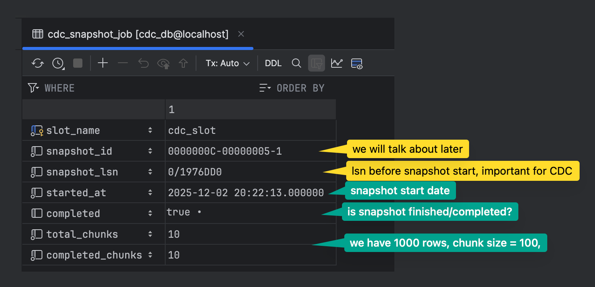
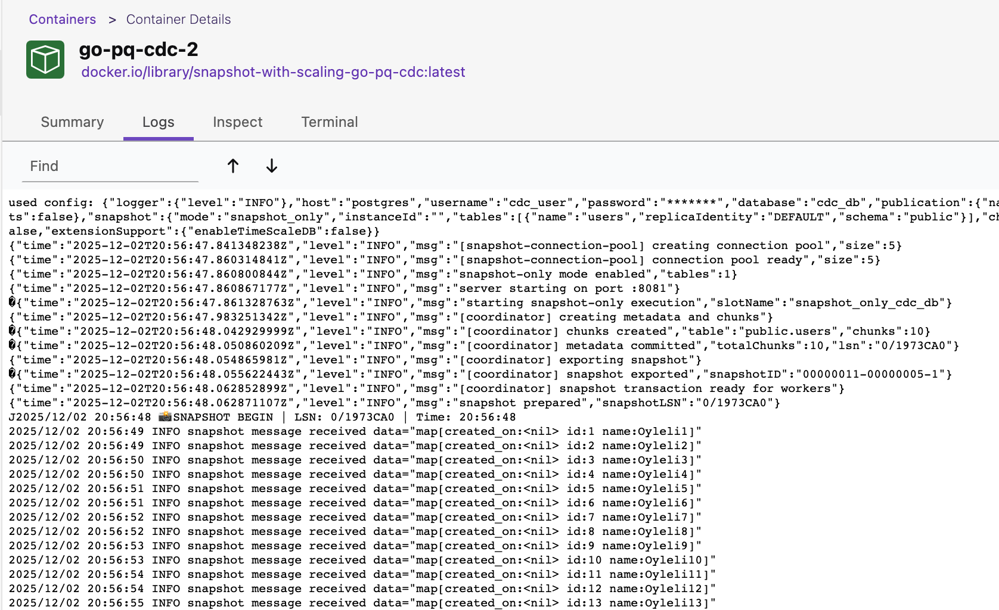
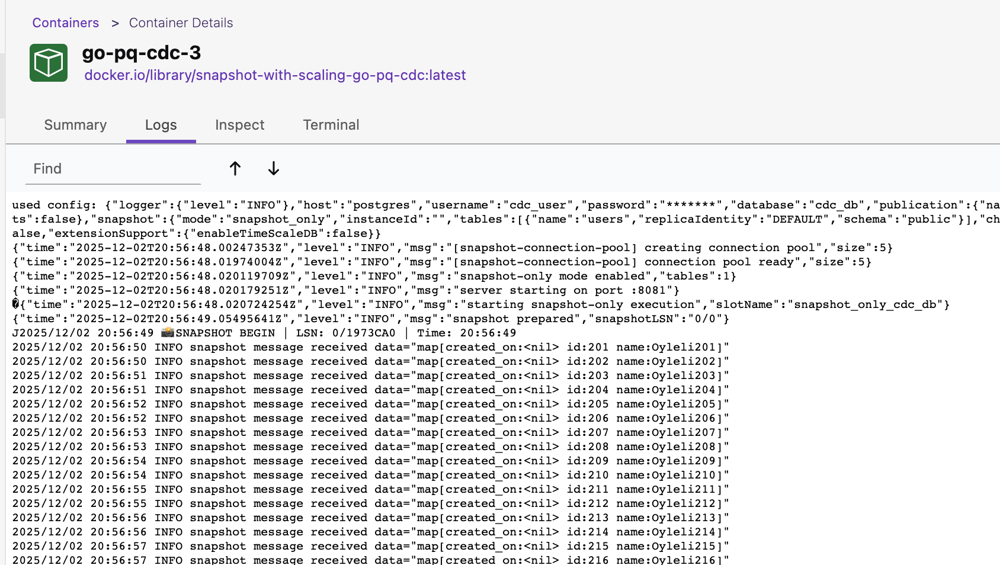

In this article, we’ll look at how we implemented snapshot mode in our [go-pq-cdc](https://github.com/Trendyol/go-pq-cdc) PostgreSQL CDC library, and how it works under the hood.

## What is go-pq-cdc?

* [go-pq-cdc](https://github.com/Trendyol/go-pq-cdc) is our PostgreSQL CDC _(Change Data Capture)_ library. It is built on top of [PostgreSQL's logical replication protocol](https://www.postgresql.org/docs/current/logical-replication.html). It's a [Debezium](https://debezium.io/) alternative but in a better way in terms of resource consumption and performance [benchmarks](https://github.com/Trendyol/go-pq-cdc/tree/main/benchmark).

* The CDC part of this library has been running in production for over a year. Thanks to [Serhat Karabulut](https://www.linkedin.com/in/serhat-karabulut/). He wrote this project and provided significant support throughout the entire process.

* PostgreSQL to [Kafka](https://github.com/Trendyol/go-pq-cdc-kafka) and [Elasticsearch](https://github.com/Trendyol/go-pq-cdc-elasticsearch) connectors are also available and used in production.


> Before we dive into the snapshot feature, let’s briefly cover a few key PostgreSQL concepts.

## What is logical replication? 

> [Logical replication](https://www.postgresql.org/docs/current/logical-replication.html) is a method of replicating data objects and their changes, based upon their replication identity (usually a primary key). It uses a publish-subscribe model.

## Publication

* [Publication](https://www.postgresql.org/docs/current/logical-replication-publication.html#LOGICAL-REPLICATION-PUBLICATION) is a set of **changes** _(insert, update, delete, truncate)_ generated from a table or a group of tables.
  
  ```go
  publication.Config{
    Name:              "cdc_publication",
    Operations: publication.Operations{
        publication.OperationInsert,
        publication.OperationDelete,
        publication.OperationTruncate,
        publication.OperationUpdate,
    },
    Tables: publication.Tables{
        publication.Table{
            Name:            "books",
            ReplicaIdentity: publication.ReplicaIdentityDefault,
            Schema:          "public",
        },
        publication.Table{
            Name:            "users",
            ReplicaIdentity: publication.ReplicaIdentityFull,
            Schema:          "public",
        },
    },
  }
  ```

We mentioned that a publication is a set of operations. But how do we identify which rows were updated or deleted? This is where [`Replication Identity`](https://www.postgresql.org/docs/current/logical-replication-publication.html#LOGICAL-REPLICATION-PUBLICATION-REPLICA-IDENTITY) comes into play.

* By default, this is the primary key, if there is one.
* If the table doesn't have a suitable key, then the entire row becomes the key.

In our library, we support two replication identity options:

```go
ReplicaIdentityOptions = []string{ReplicaIdentityDefault, ReplicaIdentityFull}
ReplicaIdentityMap     = map[string]string{
    "d": ReplicaIdentityDefault, // primary key
    "f": ReplicaIdentityFull,    // full row
}
```

## Replication Slot

- [Replication Slot](https://www.postgresql.org/docs/current/warm-standby.html#STREAMING-REPLICATION-SLOTS) is a server-side object that tracks a replica's progress and **retains WAL files** to prevent them from being deleted before the replica has consumed them. This concept existed before logical replication was introduced, but it's also used in logical replication.

- In the logical replication context, a replication slot holds the [Log Sequence Number (LSN)](https://www.postgresql.org/docs/18/datatype-pg-lsn.html)—a position in the transaction log (WAL/XLOG). Every time the subscriber successfully receives and processes data, the slot's LSN is advanced. This ensures no data loss and enables accurate restart from the last processed position.

Here's how you configure a replication slot in go-pq-cdc:

```go
Slot: slot.Config{
    Name:  "cdc_slot"
}
```

> There is a library-specific config `slot.slotActivityCheckerInterval` that continuously tracks the slot activity. If the replication slot becomes inactive, go-pq-cdc automatically reclaims the slot and resumes data capturing for high availability.

## How it is used in go-pq-cdc?

Full example [here](https://github.com/Trendyol/go-pq-cdc/tree/main/example/simple).

### Configuration

First, set up the configuration with publication, slot, and other settings:

```go
cfg := config.Config{
    // PostgreSQL connection credentials (Host, Port, User, Password, Database)
    Publication: publication.Config{
        CreateIfNotExists: true,
        Name:              "cdc_publication",
        Operations: publication.Operations{
            publication.OperationInsert,
            publication.OperationDelete,
            publication.OperationTruncate,
            publication.OperationUpdate,
        },
        Tables: publication.Tables{
            publication.Table{
                Name:            "users",
                ReplicaIdentity: publication.ReplicaIdentityDefault,
                Schema:          "public",
            },
        },
    },
    Slot: slot.Config{
        CreateIfNotExists:           true,
        Name:                        "cdc_slot",
    },
    Metric: config.MetricConfig{
        Port: 8081,
    },
    Logger: config.LoggerConfig{
        LogLevel: slog.LevelInfo,
    },
}

connector, err := cdc.NewConnector(ctx, cfg, Handler)
if err != nil {
    slog.Error("new connector", "error", err)
    os.Exit(1)
}

defer connector.Close()
connector.Start(ctx)
```

#### Handler Function

Subscribe to changes by providing a handler function that processes different message types:

```go
func Handler(ctx *replication.ListenerContext) {
	switch msg := ctx.Message.(type) {
	case *format.Insert:
		slog.Info("insert message received", "new", msg.Decoded)
	case *format.Delete:
		slog.Info("delete message received", "old", msg.OldDecoded)
	case *format.Update:
		slog.Info("update message received", "new", msg.NewDecoded, "old", msg.OldDecoded)
	}

	if err := ctx.Ack(); err != nil {
		slog.Error("ack", "error", err)
	}
}
```

> By calling `ctx.Ack()`, we signal that we've processed this message and the WAL LSN position should be advanced. There's no need to keep that message change anymore in the wal segment.

## Snapshot Feature

In database terminology, a snapshot refers to a copy of a database (or table in a database) that is taken at a particular point in time—just like taking a snapshot with a camera ([From Streaming Databases Book](https://www.oreilly.com/library/view/streaming-databases/9781098154820/)).

### Why Do We Need a Snapshot?

The **Snapshot Feature** enables **initial data capture** from PostgreSQL tables before starting Change Data Capture (CDC). This ensures that your downstream systems receive both:

1. **Existing data** (via snapshot)
2. **Real-time changes** (via CDC)

Without snapshot support, CDC only captures changes that occur **after the replication slot is created**, missing all pre-existing data.

Consider this scenario:

```
Timeline:
  T0: Table "users" has 1M rows
  T1: You start go-pq-cdc (CDC only)
  T2: 10 new rows inserted
  
Result: You only get 10 rows, missing the initial 1M rows! ❌
```

With snapshot enabled:

```
Timeline:
  T0: Table "users" has 1M rows
  T1: You start go-pq-cdc with snapshot enabled
      - Snapshot captures 1M rows at LSN=X
      - Replication slot created at LSN=X or LSN=<X
  T2: 10 new rows inserted (at LSN=Y, Y > X)
  T3: Snapshot completes, CDC starts from LSN=X
      - CDC captures the 10 new rows
  
Result: You get all 1M + 10 rows, with no duplicates!
```

> In other words, pure CDC alone can never give you the historical state of the table; it only tells you what changed after you started.


There are three snapshot mode options available:

- **`initial`** Take a snapshot once (only if no previous snapshot exists), then continue with CDC from that point. 
- **`snapshot_only`**: Take a snapshot and then exit. No CDC and no publication/replication slot are used.
- **`never`**: Do not take a snapshot; start CDC immediately from the replication slot’s position. (default)

Internally, the snapshot process uses a **coordinator/worker** model and **two metadata tables** to track progress. We will get into the details later.

Let's see how it's used first.

### Quick Start (How to Use Snapshot in go-pq-cdc)

- **Enable snapshot**: Set `snapshot.enabled = true` and choose a `mode` (`initial`, `snapshot_only`, or `never`).
- **Configure tables**: Use `publication.tables` (for `initial`) or `snapshot.tables` (for `snapshot_only`) to list the tables you want.
- **Handle events**: In your handler, process `*format.Snapshot` events (`Begin`, `Data`, `End`) alongside normal CDC events.
- **CDC continuation**: In `initial` mode, once snapshot is done, CDC automatically continues from the captured LSN — no gaps, no duplicates.

### How snapshot mode 'Initial' is used

Full example [here](https://github.com/Trendyol/go-pq-cdc/tree/main/example/snapshot-initial-mode).

We have `users` table. `1000` users exist. 

#### Configuration

```go
cfg := config.Config{
    // PostgreSQL connection credentials (Host, Port, User, Password, Database)
    Publication: publication.Config{
        CreateIfNotExists: true,
        Name:              "cdc_publication",
        Operations: publication.Operations{
            publication.OperationInsert,
            publication.OperationDelete,
            publication.OperationTruncate,
            publication.OperationUpdate,
        },
        Tables: publication.Tables{
            publication.Table{
                Name:            "users",
                ReplicaIdentity: publication.ReplicaIdentityDefault,
                Schema:          "public",
            },
        },
    },
    Slot: slot.Config{
        CreateIfNotExists:           true,
        Name:                        "cdc_slot",
    },
    Snapshot: config.SnapshotConfig{ // -- NEWLY ADDED!
        Enabled:           true,
        Mode:              config.SnapshotModeInitial, 
        ChunkSize:         100,
        ClaimTimeout:      30 * time.Second,
        HeartbeatInterval: 5 * time.Second,
    }
    Metric: config.MetricConfig{
        Port: 8081,
    },
    Logger: config.LoggerConfig{
        LogLevel: slog.LevelInfo,
    },
}

connector, err := cdc.NewConnector(ctx, cfg, Handler)
if err != nil {
    slog.Error("new connector", "error", err)
    os.Exit(1)
}

defer connector.Close()
connector.Start(ctx)
```

#### Handler Function

Subscribe to snapshot and changes by providing a handler function that processes different message types:

```go
func Handler(ctx *replication.ListenerContext) {
	switch msg := ctx.Message.(type) {
	case *format.Insert:
		slog.Info("insert message received", "new", msg.Decoded)
	case *format.Delete:
		slog.Info("delete message received", "old", msg.OldDecoded)
	case *format.Update:
		slog.Info("update message received", "new", msg.NewDecoded, "old", msg.OldDecoded)
	case *format.Snapshot:
		handleSnapshot(msg)
	}

	if err := ctx.Ack(); err != nil {
		slog.Error("ack", "error", err)
	}
}

func handleSnapshot(s *format.Snapshot) {
	switch s.EventType {
	case format.SnapshotEventTypeBegin:
		log.Printf("📸 SNAPSHOT BEGIN | LSN: %s | Time: %s",
			s.LSN.String(),
			s.ServerTime.Format("15:04:05"))

	case format.SnapshotEventTypeData:
		slog.Info("snapshot message received", "data", s.Data)

	case format.SnapshotEventTypeEnd:
		log.Printf("📸 SNAPSHOT END | LSN: %s | Time: %s",
			s.LSN.String(),
			s.ServerTime.Format("15:04:05"))
	}
}
```

> We expose explicit snapshot begin and end markers so that consumers can control how they handle the snapshot window.

> Note: Snapshot messages are not tied to WAL positions, so `ctx.Ack()` is a no‑op and always returns nil during snapshot.

### Monitoring

There are two metadata tables.

- **cdc_snapshot_job**: Metadata table for snapshot process tracking


- **cdc_snapshot_chunks**: Each chunk represents work to be done


  - `chunk_start` and `chunk_end`: Used for **non-numeric** primary keys with `LIMIT/OFFSET` queries
  - `range_start` and `range_end`: Used for **numeric** primary keys with range-based `WHERE` clauses for better performance
 
  > Range scanning on a numeric PK is not only faster than LIMIT/OFFSET but also avoids performance degradation as the offset grows. 
 
  ```go
  func (s *Snapshotter) buildChunkQuery(chunk *Chunk, orderByClause string, pkColumns []string) string {
      if chunk.hasRangeBounds() && len(pkColumns) == 1 {
          pkColumn := pkColumns[0]
  
          return fmt.Sprintf(
              "SELECT * FROM %s.%s WHERE %s >= %d AND %s <= %d ORDER BY %s LIMIT %d",
              chunk.TableSchema,
              chunk.TableName,
              pkColumn,
              *chunk.RangeStart,
              pkColumn,
              *chunk.RangeEnd,
              orderByClause,
              chunk.ChunkSize,
          )
      }
  
      return fmt.Sprintf(
          "SELECT * FROM %s.%s ORDER BY %s LIMIT %d OFFSET %d",
          chunk.TableSchema,
          chunk.TableName,
          orderByClause,
          chunk.ChunkSize,
          chunk.ChunkStart,
      )
  }
  ```   
    > Currently we only use range bounds when there is a single numeric primary key; composite keys fall back to LIMIT/OFFSET chunking.

  - `claimed_by`: Shows which instance is responsible for that chunk
  - `claimed_at`: Shows when the instance was assigned to the chunk
  - `heartbeat_at`: Instance heartbeat updates, so we can determine if it's alive or not. If the heartbeat stops, after `claimTimeout` passes, the chunk is released and a new instance is assigned. You can control this via
  ```go
  Snapshot: config.SnapshotConfig{
      ...
      ClaimTimeout:      30 * time.Second, <-- timeout to reclaim stale chunks
      HeartbeatInterval: 5 * time.Second, <-- heartbeat at every 5 sec
  }
  ```

### How snapshot mode 'Snapshot Only' is used

Full example [here](https://github.com/Trendyol/go-pq-cdc/tree/main/example/snapshot-only-mode).

We have `users` table. `100` users exist.

#### Configuration
- **Note**: No need to provide slot or publication configuration for snapshot-only mode 

```go
cfg := config.Config{
    // PostgreSQL connection credentials (Host, Port, User, Password, Database)
    Snapshot: config.SnapshotConfig{
        Enabled:           true,
        Mode:              config.SnapshotModeSnapshotOnly,
        Tables: publication.Tables{ // --> Snapshot tables
            publication.Table{
                Name:            "users",
                ReplicaIdentity: publication.ReplicaIdentityDefault,
                Schema:          "public",
            },
        }, 
        ChunkSize:         100,
        ClaimTimeout:      30 * time.Second,
        HeartbeatInterval: 5 * time.Second,
    }
    Metric: config.MetricConfig{
        Port: 8081,
    },
    Logger: config.LoggerConfig{
        LogLevel: slog.LevelInfo,
    },
}

connector, err := cdc.NewConnector(ctx, cfg, Handler)
if err != nil {
    slog.Error("new connector", "error", err)
    os.Exit(1)
}

defer connector.Close()
connector.Start(ctx)
```

#### Handler Function

Subscribe to snapshot messages by providing a handler function:

```go
func Handler(ctx *replication.ListenerContext) {
	msg := ctx.Message.(*format.Snapshot)

	switch msg.EventType {
	case format.SnapshotEventTypeBegin:
		log.Printf("📸 SNAPSHOT BEGIN | LSN: %s | Time: %s",
			msg.LSN.String(),
			msg.ServerTime.Format("15:04:05"))

	case format.SnapshotEventTypeData:
		slog.Info("snapshot message received", "data", msg.Data)

	case format.SnapshotEventTypeEnd:
		log.Printf("📸 SNAPSHOT END | LSN: %s | Time: %s",
			msg.LSN.String(),
			msg.ServerTime.Format("15:04:05"))
	}
}
```

### Scaling Snapshot Process

We can easily scale horizontally during the snapshot process. 

Full example [here](https://github.com/Trendyol/go-pq-cdc/tree/main/example/snapshot-with-scaling).

There is no specific configuration or handling required in the codebase for scaling.

Let's play with it by scaling to 3 containers `docker-compose up --scale go-pq-cdc=3 -d`






## Snapshot Architecture Basics (How It Works Internally)

> The rest of this article explains how we implemented snapshotting under the hood. You don’t need this part to use the feature, but it’s useful if you care about the internals or want to adapt the design.

Before we walk through the snapshot lifecycle, we need to explain a couple of concepts.

### pg_try_advisory_lock()

`pg_try_advisory_lock` is a **non-blocking** function in PostgreSQL. It attempts to acquire an application-level lock 
using a key you specify. If the lock is already held by another session _(in our case instance)_, the function returns 
`FALSE` immediately instead of waiting.

```go
lockID := hashString(slotName)  // e.g., "cdc_slot" -> 12345
acquired := SELECT pg_try_advisory_lock(lockID)
```

When multiple instances start simultaneously, they need to elect a coordinator:

```
Coordinator Election
───────────────────────────────
   ┌─────────┐
   │Instance1│──pg_try_advisory_lock()──► Success (Coordinator)
   └─────────┘
   ┌─────────┐
   │Instance2│──pg_try_advisory_lock()──► Fail (Worker)
   └─────────┘
   ┌─────────┐
   │Instance3│──pg_try_advisory_lock()──► Fail (Worker)
   └─────────┘
```

> Advisory locks are automatically released when the connection closes.
> If you are using PgBouncer, prefer transaction pooling mode here; session mode may cause surprising behavior with advisory locks because connections are reused across sessions.

### Repeatable Read Isolation Level

The `Repeatable Read` isolation level guarantees that any rows a transaction reads will remain unchanged for 
the duration of that transaction, preventing non-repeatable reads. Let's examine it with an example.

```
┌──────────┬─────────────────────────────────────┬─────────────────────────────────────┐
│   Time   │  Transaction A (Repeatable Read)    │  Transaction B (Normal)             │
├──────────┼─────────────────────────────────────┼─────────────────────────────────────┤
│    T1    │  BEGIN TRANSACTION ISOLATION        │                                     │
│          │  LEVEL REPEATABLE READ;             │                                     │
│          │  → Takes snapshot of data           │                                     │
├──────────┼─────────────────────────────────────┼─────────────────────────────────────┤
│    T2    │  SELECT balance FROM Accounts       │                                     │
│          │  WHERE AccountID = 1;               │                                     │
│          │  → Result: 500 ₺                    │                                     │
├──────────┼─────────────────────────────────────┼─────────────────────────────────────┤
│    T3    │                                     │  BEGIN TRANSACTION;                 │
├──────────┼─────────────────────────────────────┼─────────────────────────────────────┤
│    T4    │                                     │  UPDATE Accounts SET balance = 400  │
│          │                                     │  WHERE AccountID = 1;               │
├──────────┼─────────────────────────────────────┼─────────────────────────────────────┤
│    T5    │                                     │  COMMIT; ✓                          │
│          │                                     │  → 400 ₺ is now permanent           │
├──────────┼─────────────────────────────────────┼─────────────────────────────────────┤
│    T6    │  SELECT balance FROM Accounts       │                                     │
│          │  WHERE AccountID = 1;               │                                     │
│          │  → Result: 500 ₺ (still!)           │                                     │
├──────────┼─────────────────────────────────────┼─────────────────────────────────────┤
│    T7    │  COMMIT;                            │                                     │
└──────────┴─────────────────────────────────────┴─────────────────────────────────────┘
```

**Key Point**: Transaction A always reads from the data **as it was at T1**, regardless of B's commit at T5. This is how we ensure all instances read a consistent, frozen view of the data during the entire snapshot.

In our library, the coordinator exports a PostgreSQL snapshot and keeps it open during the snapshot process:

```go
// 1. Start transaction (REPEATABLE READ for consistency)
BEGIN TRANSACTION ISOLATION LEVEL REPEATABLE READ

// 2. Export snapshot
snapshotID := SELECT pg_export_snapshot()  
// Returns: "00000003-00000002-1"

// 3. Keep transaction OPEN!
// (Do NOT commit/rollback yet)

// 4. Update job metadata
UPDATE cdc_snapshot_job 
SET snapshot_id = '00000003-00000002-1'
WHERE slot_name = 'cdc_slot'
```

**Why?** Because when we are using multiple instances, we need to ensure that all instances see same snapshot of the data.

By exporting the coordinator transaction’s snapshot using `pg_export_snapshot()`, workers can read this value from `cdc_snapshot_job`
and set their own transactions to it, so we provide transactional consistency.

```
┌─────────────────────────────────────────────────────────────┐
│  Coordinator Transaction (REPEATABLE READ)                  │
│  ┌────────────────────────────────────────────────────┐    │
│  │ BEGIN                                               │    │
│  │ SELECT pg_export_snapshot() → 'snapshot_123'       │    │
│  │ ... (transaction stays open) ...                   │    │
│  │                                                     │    │
│  │  ┌──────────────────────────────────────────────┐ │    │
│  │  │ Worker 1: SET TRANSACTION SNAPSHOT 'snap123' │ │    │
│  │  │ SELECT * FROM users ... (sees same data!)    │ │    │
│  │  └──────────────────────────────────────────────┘ │    │
│  │                                                     │    │
│  │  ┌──────────────────────────────────────────────┐ │    │
│  │  │ Worker 2: SET TRANSACTION SNAPSHOT 'snap123' │ │    │
│  │  │ SELECT * FROM orders ... (sees same data!)   │ │    │
│  │  └──────────────────────────────────────────────┘ │    │
│  │                                                     │    │
│  │ COMMIT (after all chunks done)                     │    │
│  └────────────────────────────────────────────────┘    │
└─────────────────────────────────────────────────────────────┘

If coordinator closed transaction early:
  ❌ Snapshot ID becomes invalid
  ❌ Workers can't use SET TRANSACTION SNAPSHOT
  ❌ Data inconsistency across chunks
  ❌ All snapshot process is aborted. It will start to take new snapshot!

```

> Because the coordinator holds a long‑running REPEATABLE READ transaction, old row versions must be kept until the 
> snapshot finishes. For most initial‑load scenarios this is acceptable, but you should be aware of the potential 
> for extra bloat while a long snapshot is running.

### How We Ensure No Data Is Missed

How do we ensure no data is missed between snapshot and CDC process?

Before starting the snapshot, we capture the current LSN with `pg_current_wal_lsn()`.

The single value returned by `SELECT pg_current_wal_lsn()` represents the absolute location of the last point the primary server has written to the Write-Ahead Log (WAL).

We use this value as the starting LSN when we start the replication slot stream:

`START_REPLICATION SLOT cdc_slot LOGICAL 0/12345678`

```
Timeline:
─────────────────────────────────────────────────────────────►
         │                    │                    │
         T0                   T1                   T2
    Snapshot LSN         Snapshot End         Current Time
    (0/12345678)
         │                    │                    │
         ├────────────────────┤────────────────────►
         │   Snapshot Data    │    CDC Data        │
         │   (goes to handler)│  (goes to handler) │
         │                    │                    │
         │◄───────────────────┤                    │
         No overlap!    CDC starts from snapshot LSN
```

Simply, all rows selected during snapshot are guaranteed to be visible as of the snapshot’s MVCC view; any later changes will appear as logical replication events after we start CDC at the stored LSN.

## Snapshot Lifecycle

The snapshot process consists of 5 phases:

### Phase 1: Coordinator Election

```
Instance1 ──pg_try_advisory_lock()──► Success (Coordinator) ✓
Instance2 ──pg_try_advisory_lock()──► Fail (Worker)
Instance3 ──pg_try_advisory_lock()──► Fail (Worker)
```

Only one instance becomes the coordinator. Others become workers.

### Phase 2: Metadata Creation (Coordinator Only)

```sql
-- Capture current LSN
SELECT pg_current_wal_lsn(); -- → 0/12345678

-- Create job metadata  
INSERT INTO cdc_snapshot_job (...);

-- Split tables into chunks
-- Table "users": 1M rows → 10 chunks (100K each)
INSERT INTO cdc_snapshot_chunks (...);
```

### Phase 3: Snapshot Export (Coordinator Only)

```sql
BEGIN TRANSACTION ISOLATION LEVEL REPEATABLE READ;
SELECT pg_export_snapshot(); -- → "00000003-00000002-1"
-- Keep transaction OPEN! (critical)
UPDATE cdc_snapshot_job SET snapshot_id = '00000003-00000002-1';
-- Workers can now join using this snapshot_id
```

After that, the coordinator simply acts as another worker.

### Phase 4: Chunk Processing (All Instances in Parallel)

```
Worker Loop:
┌─► Claim next chunk (SELECT FOR UPDATE SKIP LOCKED)
│   ├─► BEGIN TRANSACTION
│   ├─► SET TRANSACTION SNAPSHOT 'snapshot_id'
│   ├─► SELECT * FROM table WHERE id >= X AND id <= Y
│   ├─► Send DATA events to handler
│   ├─► COMMIT
│   ├─► Mark chunk completed
└───┴── Repeat until no chunks left
```

### Phase 5: CDC Continuation

- All chunks completed → Snapshot transaction closed
- CDC starts from snapshot LSN (`START_REPLICATION SLOT ... LOGICAL 0/12345678`)
- **No duplicate data!** Snapshot ends where CDC begins.

### Crash Recovery

What happens if an instance crashes during snapshot?

**Worker Crash**: The chunk being processed becomes "stale" after `claimTimeout` (e.g., 30s). Another instance automatically reclaims and reprocesses it.

```
Before Crash:
  C0: completed ✓    C3: pending
  C1: completed ✓    C4: pending  
  C2: in_progress ← crashed here

After Restart (30s later):
  C2 becomes stale → reclaimed by healthy instance
```

**Coordinator Crash Before Export**: Incomplete job is detected on restart. The system cleans up and **restarts snapshot from scratch**.

When a worker (or a new instance) comes back, processing resumes from where it left off — completed chunks are skipped, pending chunks are processed.

---

## Summary

The Snapshot Feature provides a robust, scalable solution for initial data capture:

- ✅ **Zero Data Loss**: Consistent snapshot + CDC continuation
- ✅ **Scalable**: Chunk-based, multi-instance parallel processing  
- ✅ **Resilient**: Automatic crash recovery
- ✅ **Observable**: Metadata tables for progress tracking

For more details, check out the [go-pq-cdc repository](https://github.com/Trendyol/go-pq-cdc).

> Thank you for reading!

---